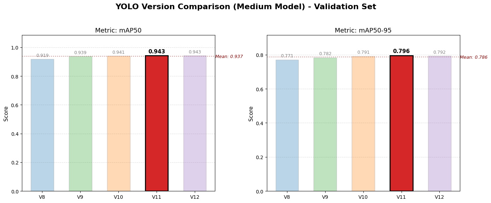
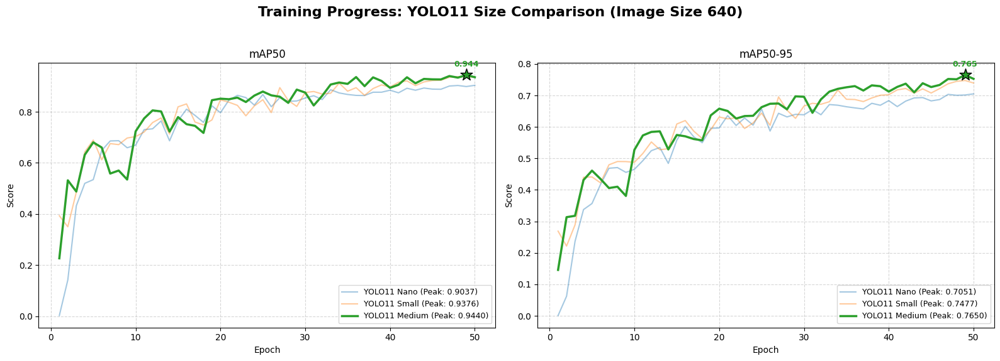
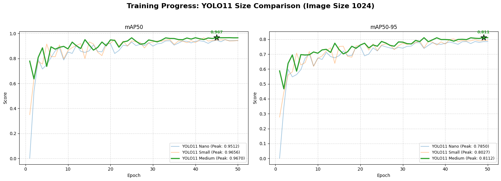
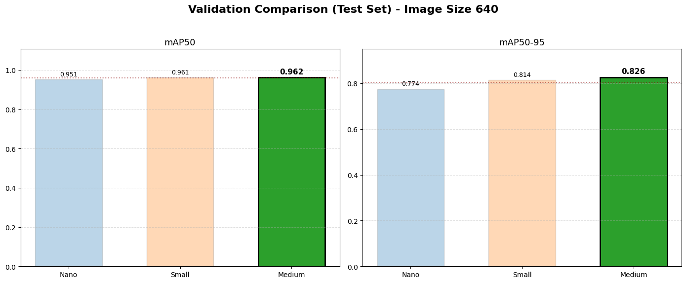
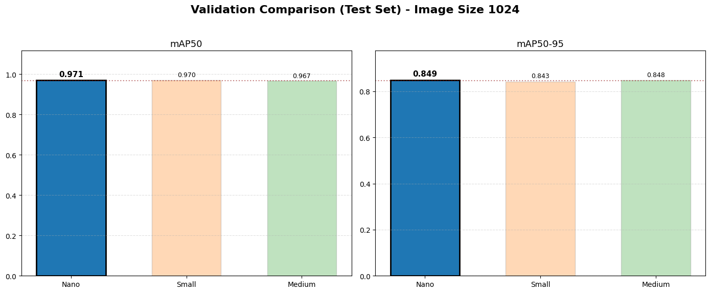
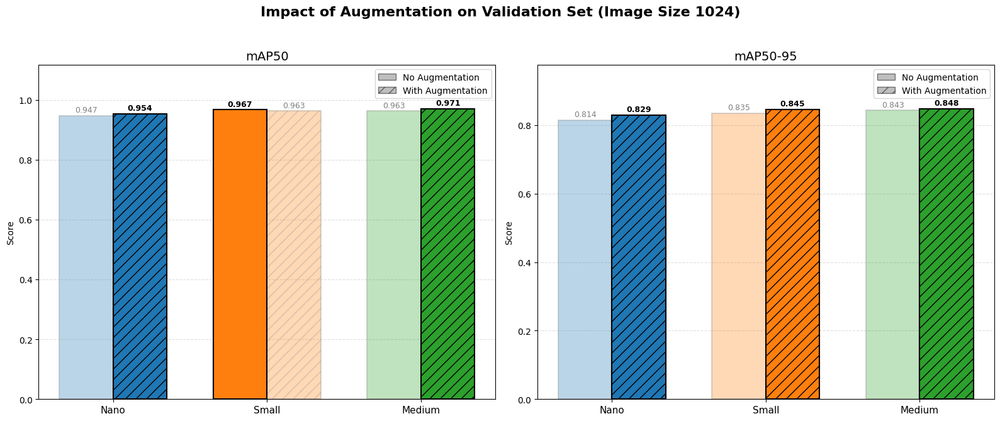
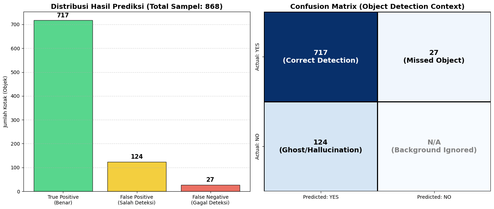
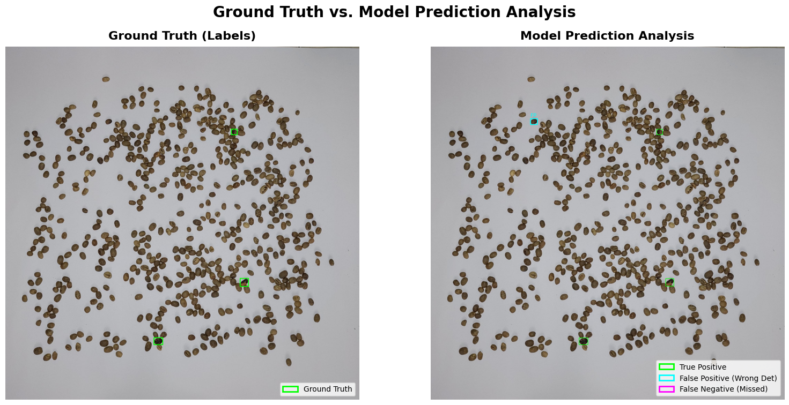

# 🌱 Deteksi Anomali Biji Kopi dengan YOLO
Proyek ini membangun sistem deteksi anomali biji kopi hijau (hitam, hitam sebagian, kulit kopi kecil) berbasis YOLO. Eksperimen dilakukan lintas versi YOLO (v8–v12), variasi ukuran model (nano/small/medium), serta perbandingan resolusi (640 vs 1024) dan augmentasi data. Semua eksperimen dan visualisasi terekam di `notebook.ipynb` dengan log ke MLflow/DagsHub.

## 🔍 Ringkasan Isi `notebook.ipynb`
- Setup: impor OpenCV, Torch, Ultralytics YOLO, Supervision (tracking), Roboflow (unduh dataset), MLflow + DagsHub untuk pelacakan eksperimen.
- Dataset: mengunduh 3 kelas dalam tiga varian (tanpa augmentasi, augmentasi brightness, augmentasi brightness+rotation+flip) ke `dataset_collection/`.
- Eksperimen 1: bandingkan YOLO v8–v12 (model medium, imgsz 640, 50 epoch, batch 16) pada dataset tanpa augmentasi.
- Eksperimen 2: bandingkan YOLO11 nano/small/medium dengan imgsz 640.
- Eksperimen 3: bandingkan YOLO11 nano/small/medium dengan imgsz 1024.
- Eksperimen 4: latih YOLO11 nano/small/medium imgsz 1024 pada dataset augmentasi brightness+rotation+flip.
- Evaluasi & visualisasi: simpan `results.csv`, `class_metrics_*`, confusion matrix, kurva mAP/P/R, serta grafik agregat ke `graph_output/`.
- Inferensi & analisis: prediksi subset test (`results/best_model_predictions/`), evaluasi false positive/false negative, serta object counting + tracking ByteTrack pada video conveyor (output di `video_output/`).

## 📊 Hasil Utama
**Perbandingan YOLO v8–v12 (medium, imgsz 640, tanpa augmentasi)**
| Model | Precision | Recall | mAP50 | mAP50-95 |
| --- | --- | --- | --- | --- |
| YOLOv8m | 0.848 | 0.872 | 0.9187 | 0.7712 |
| YOLOv9m | 0.898 | 0.884 | 0.9386 | 0.7822 |
| YOLOv10m | 0.894 | 0.857 | 0.9410 | 0.7910 |
| YOLOv11m | 0.901 | 0.899 | 0.9435 | 0.7956 |
| YOLOv12m | 0.933 | 0.861 | 0.9431 | 0.7922 |

**YOLO11 – Perbandingan Resolusi (tanpa augmentasi)**
| Ukuran | mAP50 (640) | mAP50-95 (640) | mAP50 (1024) | mAP50-95 (1024) |
| --- | --- | --- | --- | --- |
| Nano | 0.9236 | 0.7341 | 0.9474 | 0.8144 |
| Small | 0.9396 | 0.7813 | 0.9667 | 0.8346 |
| Medium | 0.9435 | 0.7956 | 0.9634 | 0.8428 |

**YOLO11 – Dampak Augmentasi (imgsz 1024, brightness+rotation+flip)**
| Ukuran | mAP50 | mAP50-95 |
| --- | --- | --- |
| Nano | 0.9539 | 0.8293 |
| Small | 0.9633 | 0.8452 |
| Medium | **0.9705** | **0.8481** |

Catatan: Augmentasi meningkatkan mAP50-95 pada semua ukuran, dengan hasil terbaik pada YOLO11 medium imgsz 1024 augmented.

## 🗂️ Artefak & Output
- Grafik kinerja (klik untuk perbesar):
  - 
  - 
  - 
  - 
  - 
  - 
  - 
  - 
  - 
- Video hasil counting conveyor: `video_output/` (`video_conveyor_speed_normal.mp4`, `video_conveyor_speed_normal_per_class.mp4`, `video_conveyor_speed_up.mp4`).
- Model terlatih: `results/` (contoh: `results/yolo11_imgsz_1024_augmentation_experiment/training/medium/weights/best.pt` untuk performa tertinggi; inferensi laporan menggunakan varian small, counting video memakai varian nano).
- Prediksi uji: `results/best_model_predictions/`.
- Laporan lengkap: `laporan/Visi Komputer Fundamental_Tugas Besar_Anomali Detection.pdf`.

## 🚀 Cara Pakai Singkat
1) Siapkan environment Python 3 dengan dependensi: `ultralytics`, `supervision`, `opencv-python`, `torch`, `roboflow`, `mlflow`, `dagshub`, `matplotlib`, `numpy`, `pandas`.
2) Unduh dataset via notebook (butuh API key Roboflow) atau gunakan dataset yang sudah ada di `dataset_collection/`.
3) Latih/validasi melalui `notebook.ipynb` atau langsung inferensi, contoh:
   - `yolo detect predict model=results/yolo11_imgsz_1024_augmentation_experiment/training/medium/weights/best.pt source=PATH/TO/IMAGES`
   - Untuk video counting, lihat fungsi `process_video_counting` di notebook dan jalankan dengan sumber `video_conveyor/*.mp4`.
4) Grafik kinerja tersedia di `graph_output/`, video hasil di `video_output/`, dan laporan PDF di `laporan/`.

Selamat mencoba dan selamat menyeduh kopi dengan kualitas terjaga! ☕
